
<!-- _class: lead -->
# XML e Semantic Web
Nilo Drumond

---
# Roteiro
1. World Wide Web
2. Semantic Web
3. XML
4. DTD
5. XML Schema
6. XML na Semantic Web
7. Outras aplicações do XML

---
# World Wide Web
- Conjunto de padrões
- Acessível ao ser humano
- HTML (HyperText Markup Language)
    - Identificar tipos de conteúdo e estruturas
    - Inclusão de multimidia
- Protocolo HTTP (HyperText Transfer Protocol)

<!--
HTTP (Hypertext Transfer Protocol): Este é o protocolo que permite a comunicação entre clientes e servidores na web. Quando você digita um URL na barra de endereços do seu navegador, o navegador (atuando como um cliente) envia uma solicitação HTTP para o servidor que hospeda o recurso correspondente a esse URL. O servidor então responde, enviando o recurso solicitado de volta ao cliente.
-->

---

## Tim Berners-Lee
- CERN 
    - Conseil Européen pour la Recherche Nucléaire
    - European Organization for Nuclear Research
- Comunicação e colaboração entre cientistas
- Publicar informações e criar links

<!--
- Laboratório Europeu de Física de Partícula
Facilitar a comunicação e colaboração entre cientistas ao redor do mundo.
Tornar as informações acessíveis de forma universal, independentemente do tipo de hardware, software ou infraestrutura de rede.
Criar uma estrutura de informações aberta e descentralizada onde qualquer pessoa pode publicar informações e criar links para qualquer outro documento na web.
-->

---
<!-- _class: lead -->

# Semantic Web
Web acessível para computadores

<!-- 
Uma extensão do World Wide Web
objetivo: permitir que as máquinas leiam e compreendam as informações da web
-->
--- 

# Semantic Web
- Tim Berners-Lee
- Web com semântica
- Processar, transferir e integrar informações
- Repositório de documentos 🡒 Base de conhecimento estruturada

<!--
Também foi idealizada pelo Tim
Web com semântica, que as os dados dentro da web sejam mais do que só dados, mas que essas informações tenham significados bem definidos.
Que permita a máquina processar, transferir, integrar informações.
Um exemplo que define bem, é que uma web sem semântica, se você pesquisar por "papel", ele vai te dar todas as instâncias da palavra papel, como um conjunto de caractéres. No momento que você tem a semântica, o sistema poderá entender - pelo contexto por exemplo - se você está se referindo ao material papel ou um papel que alguém desempenha no teatro. 
Ou seja, isso transforma a internet de um repositório de documentos em uma base de conhecimento estruturada. Que é capaz de mais do que só mostrar dados, mas entender eles.
-->

---

<!-- _class: lead -->
# XML
eXtensible Markup Language

<!-- 
E o principal objetivo que o XML tem  é fornecer uma maneira padronizada e estruturada de codificar dados
-->

---
# XML - História
- W3C (World Wide Web Consortium)
- Surge pouco antes da Semantic Web
- Fundamental para a Semantic Web

<!--
Estabelecido pelo W3C, que foi fundado pelo Tim Berners-Lee
Surge um pouco de Tim propor a Semantic Web, ou seja teoricamente no contexto do WWW
-->

---
# XML - Objetivos
- Legível para humanos e máquinas
- Flexibilidade
- Interoperabilidade

<!--
    Simplicidade e legibilidade: O XML foi projetado para ser fácil de ler e escrever para humanos, além de ser interpretado por máquinas. Isto é feito através de um design de texto claro e o uso de tags para descrever o conteúdo.
    Flexibilidade: O XML permite que os desenvolvedores definam suas próprias tags e estrutura de dados, o que significa que pode ser adaptado para uma ampla gama de aplicações e indústrias.
    Interoperabilidade: O XML é uma maneira eficaz de estruturar e trocar dados entre diferentes sistemas, plataformas e linguagens de programação. Ele foi projetado para ser independente de hardware e software, permitindo que os dados sejam compartilhados e compreendidos universalmente.
-->

---

# XML
- Estrutura hierárquica
- Baseado em tags
- Extensível

<!--
Representar dados estruturados e organizados. [exemplo de items de uma loja com preços]
Além de ser compreensível para máquinas, ele é legível ao ser humano, o que facilita depuração
Extensível: o usuário pode criar suas próprias tags
-->

---

# XML
- Elementos
- Atributos

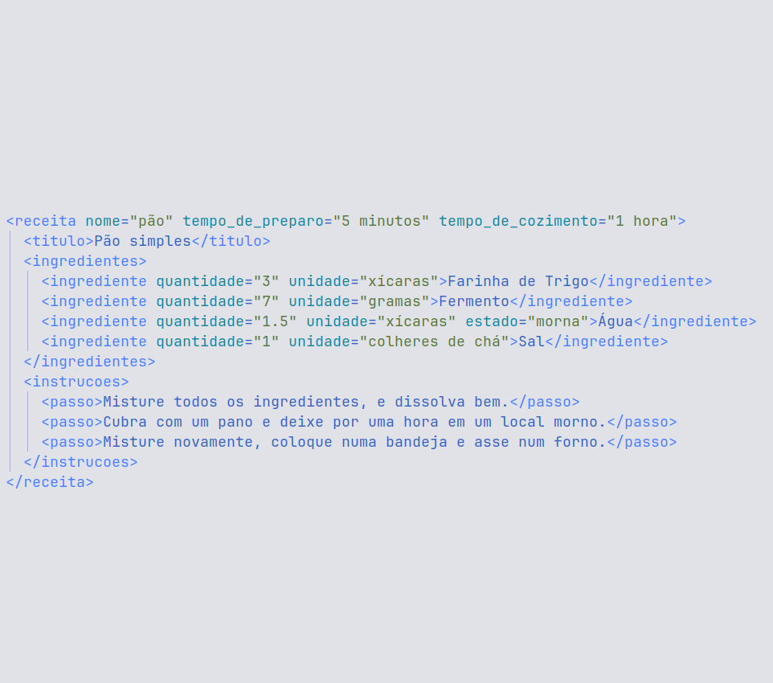

<!-- 
A base do XML são os elementos e os atributos. 
Um elemento é definido pela suas tags de abertura e fechamento e o seu conteudo.
Um atributo são dados associados a um elemento. Semelhante ao HTML.
Um elemento vazio pode carregar dados por meio de atributos.

Outra comparação com o HTML também é que:
XML tem como objetivo armazenar e estruturar os dados, não apresentar
outra linguagem, como javascript que vai ler esses dados e decidir como apresentar
-->

---
# XML - Prolog
- "Cabeçalho" do documento
- Declaração XML
    - version
    - encoding
    - standalone
- Referência externa

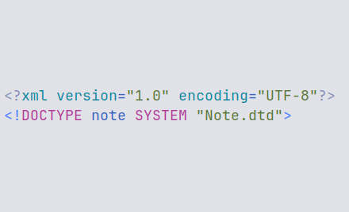

<!--
O Prolog consiste em uma declaração XML e uma opcional referência a estruturas externas
Na declaração xml nos temos esses campos:
version é a versão do XML que está sendo usada naquele arquivo
encoding é qual a codificação caracteres sendo usada
standalone é um campo opcional que diz se o documento faz referência a estruturas externas ou não.
-->

---

# Validação

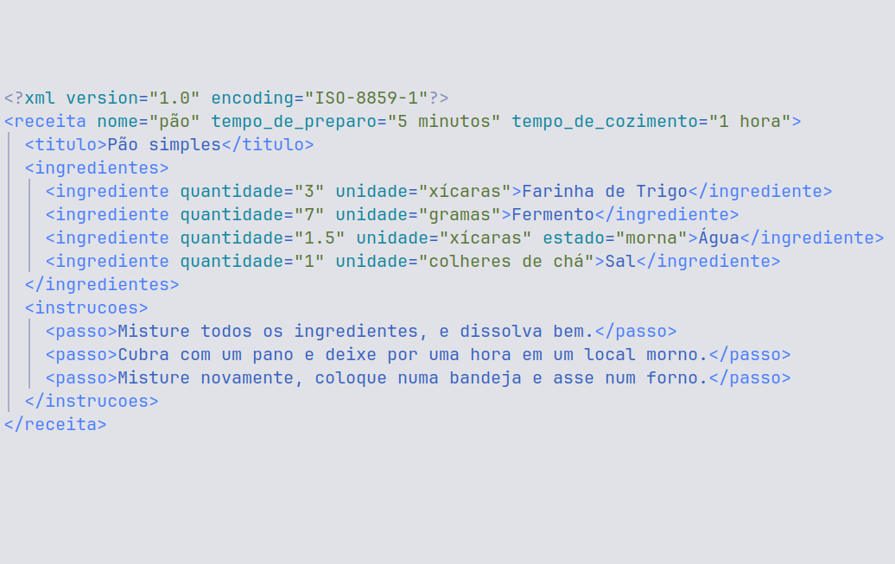
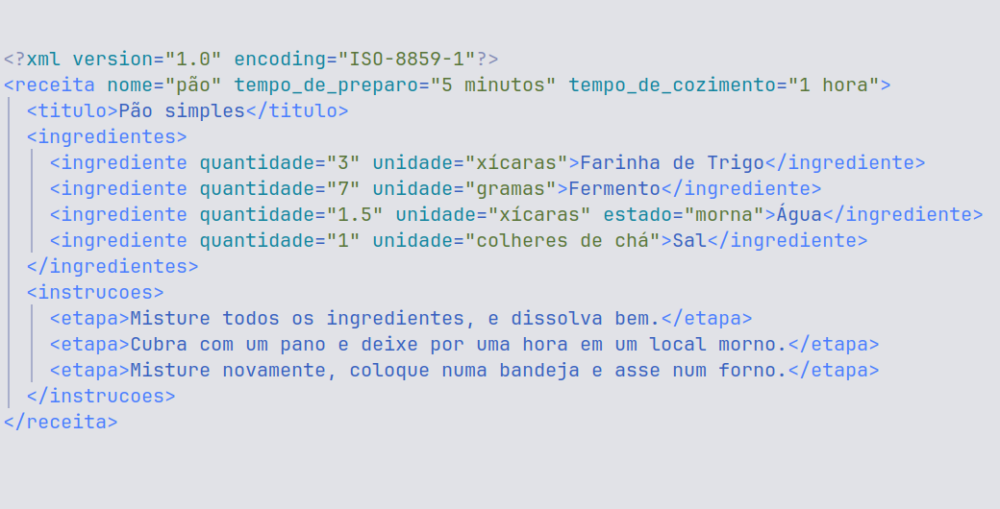

---
<!-- _class: lead -->
# DTD e XML Schema
Validar o formato do dados

<!-- 
No mesmo contexto surge a necessidade de definir formatos pros dados
de forma que diferentes grupos de pessoas concordem com o formato.
Sejam grupos diferentes equipes da mesma empresa,ou entre um cliente e um servidor...
Nos dois casos a declaração pode ser feita dentro do arquivo ou em outro arquivo. Mas na prática quase sempre é feito em um arquivo externo por mótivos manutenção e reusabilidade.
-->

--- 
<!-- _class: lead -->
# DTD
Document Type Definition
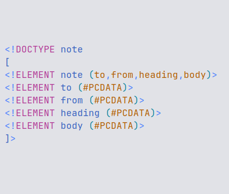

<!-- 
Numa declaração DTD nós definimos um documento. Nesse caso uma nota/note
Definimos os elementos permitidos num documento "note" e sua estrutura
nesse caso, o elemento note tem os elementos ...
e esses elementos tem dados de texto. PCDATA = texto consistente de caracteres permitidos
-->

--- 
<!-- _class: lead -->

# DTD
Document Type Definition
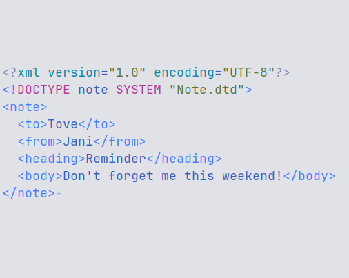

<!--
Aqui temos um exemplo de um XML que respeita o DTD mostrado no slide anterior.
Na segundo linha, ainda fazendo parte do Prolog, temos a referência externa de DOCTYPE. Que define o dtd que será usado para este documento.
nesse caso será um documento "note" que está definido no arquivo Note.dtd que está localizado em algum lugar no sistema
-->
---

# DTD
- cardinalidade
- tipos de atributos
- tipos de valor
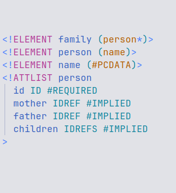

<!--
O DTD também é capaz de representar a contagem de elementos, 0-1, 0+, 1+; Normalmente se chama isso de operador de cardinalidade
Tipos de atributos: ID unico, referencia a um ID unico, string (PCDATA)
Tipos de valor: obrigatorio, opcional, fixo.
-->
---

# DTD
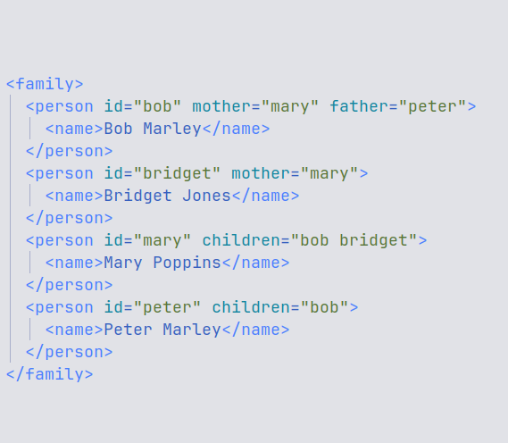

<!--
Aqui a gente tem um exemplo de XML que respeita aquele DTD
-->
---

# DTD
### Limitações
- Tipos de dados
- Namespaces

<!--
Porém, DTD tem suas limitações. Em destaque um conjunto limitado de tipos de dados e não ser capaz de suportar namespaces.
-->
---
<!-- _class: lead -->
# XML Schema

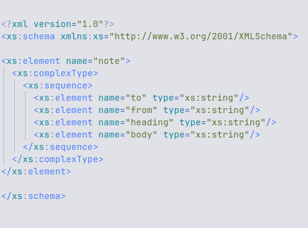

<!--
Para superar essas limitações, foi desenvolvido o XML Schema. Escrito em XML e exerce o mesmo papel do DTD só que de forma mais flexível e poderosa. 
-->

---

## DTD x XML Schema

<!--

Aqui ta uma comparação entre o DTD e o XMLS, e embora o XML seja um arquivo maior, a gente vai ver que ele é bem mais poderoso, flexível e especifico nas suas definições
-->

---

## XML Schema

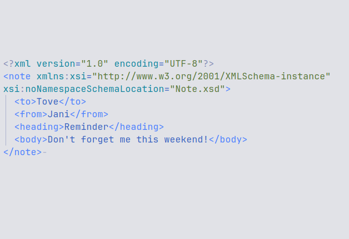

<!--
Aqui está um documento XML que respeita aquele XML Schema. Como vocês podem ver ao invés de ter aquele DOCTYPE, definimos diretamente no elemento note qual o formato dele e em que arquivo está localizado
-->

---

# XML Schema
- tipos de dados mais avançados
    - data
    - inteiros
    - decimais
- tipos de dados definidos pelo usuário

<!-- 
Alguns pontos fortes do XMLS são dados mais avançados
e tipos de dados definidos pelo usuário
-->
---

# XML Schema
## Tipos Complexos

---
## Tipos Complexos
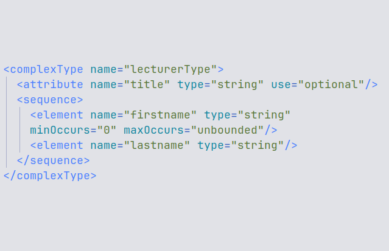
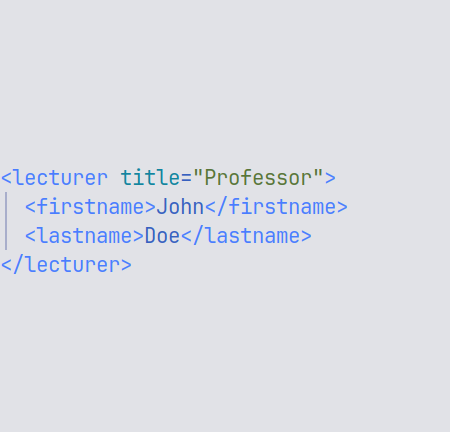

<!-- 
Aqui a gente ta definindo um tipo complexo (que são justamente esse stipos definidos pelo usuário), chamado lecturerType,
ele tem esses atributos, e essa sequencia de elementos
como vocês podem ver ele também é capaz de demonstrar cardinalidade, sendo que no XMLS se usa esse minOccurrs e maxOccurs. o tipo, que nesse caso é string
-->
---
## Tipos Complexos
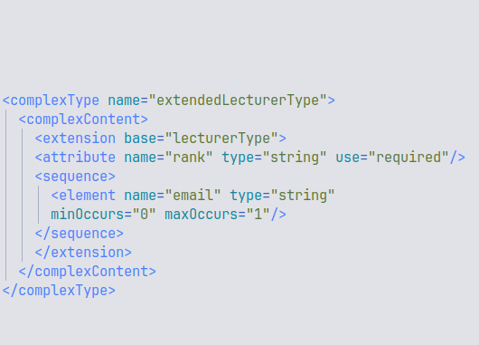
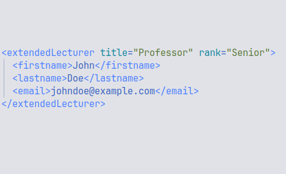

---

# XML Schema
### Namespaces
- Evitar conflitos de nome
- Reutilização
- Modularização
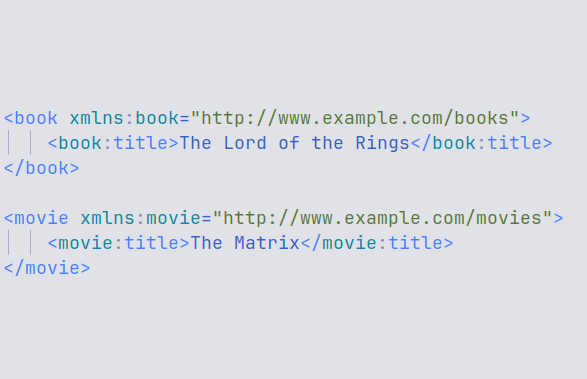

<!-- 
Outro destaque do XMLS é o suporte a namespaces do XML. O que são esses namespaces? Serve pra resolver conflitos de nome.
-->
---
## Namespaces
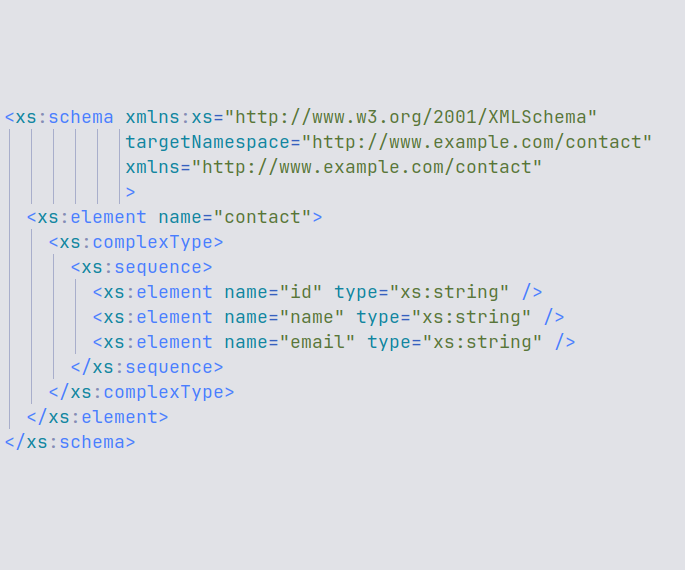
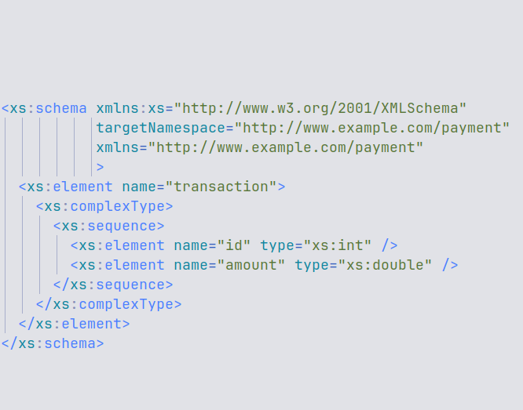

---
## Namespaces
- Evitar conflitos de nome
- Reutilização
- Modularização
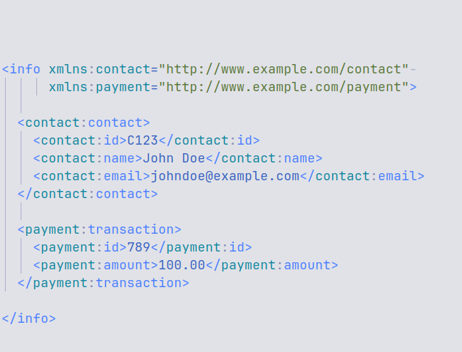

---

<!-- _class: lead -->
# XML na Semantic Web

<!--
A gente falou um pouco sobre Semantic Web, e um pouco sobre XML,
mas onde que os dois encontram
-->

---
# XML na Semantic Web
- Estruturação dos dados
- Interoperabilidade
- Base para outras tecnologias

---
<!-- _class: lead -->
# RDF
Resource Description Framework
<!--
Nesse contexto da Web semântica, uma das principais tecnologias que surgem é o RDF
Ela serve pra representar informações sobre recursos na web usando a forma de triplas
-->
---
# RDF
- sujeito
- predicado
- objeto

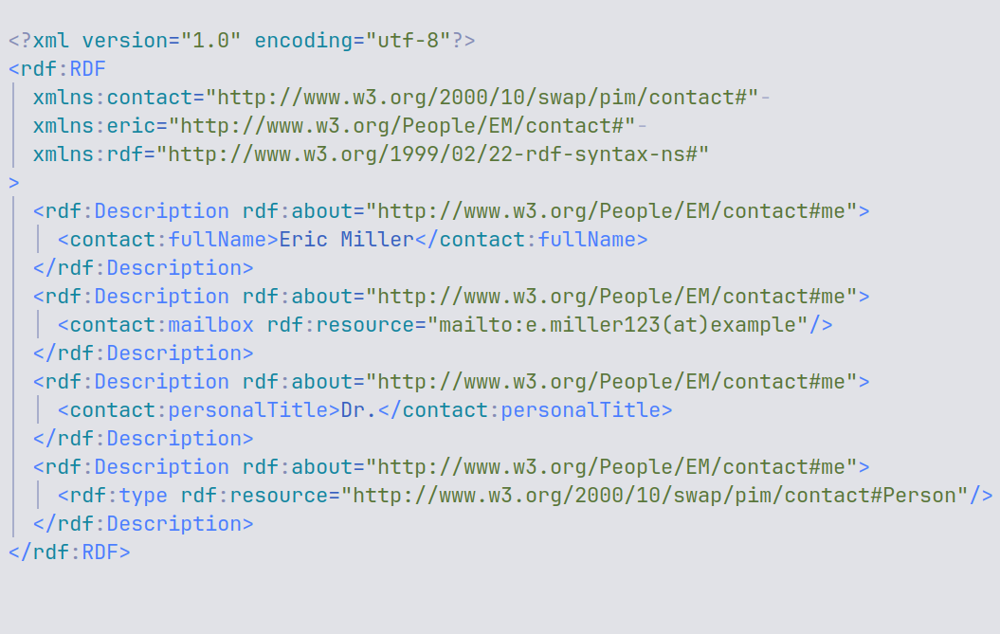

<!--
sujeito-predicado-objeto

O que é mais importante pra gente aqui nessa apresentação é esse formato de dados que está sendo usado nesse documento RDF. Que é o XML
-->

---
<!-- _class: lead -->

# Outras aplicações do XML

---

# Outras aplicações do XML
- Configurações de software
- SVG (Scalable Vector Graphics)
- RSS (Really Simple Syndication)
- ODF (OpenDocument Format)

<!--
Armazenar configurações e preferencias do usuário

ODF:
    .odt: para documentos de texto.
    .ods: para planilhas.
    .odp: para apresentações.
    .odg: para gráficos.
    .odf: para fórmulas matemáticas.
-->

---

# MathML

- Matemática acessível na web
- W3C
- Subset de apresentação
- Subset de conteúdo

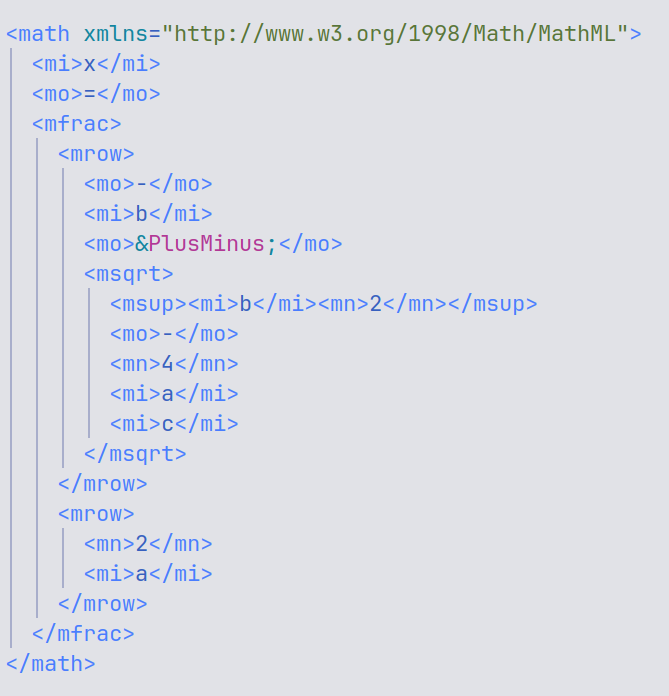

<!--
exemplo: Formula quadratica
semantico: foco no significado semantico 
semantico: nunca foi realmente implementado nos navegadores
apresentação: focado na visualização
layout: implementações incompletas e inconsistentes

-->

---

# Conclusão
- A Web Semântica 
- XML como parte da sua fundação

<!--

Recapitulando um pouco, a gente viu que a web semântica foi um passo importante em tornar a internet na internet "inteligente" de hoje, que não é apenas um conjunto aleatório de dados, mas uma rede estruturada e integrada de informações.
E o XML foi uma parte crucial de sua fundação, pois permitiu das forma a essas informações.
-->

---

# Futuro
- JSON (JavaScript Object Notation)
- YAML (YAML Ain't Markup Language)
- TOML (Tom's Obvious Minimal Language)

<!--

Embora o XML ainda tenha o seu lugar, ele não é mais tão popular quanto era antigamente. 

Para trocas de dados, depois da popularização de APIs RESTful, o JSON ganhou bastante popularidade. Tanto por ser mais leve quanto por ser suportado nativamente pelo Javascript, que é a linguagem da web querendo ou não considerando que é o que todo o navegador roda.

Para arquivos de configuração/definição, TOML e YAML representam alternativas muito mais leves e legíveis. 

Mas ainda há o seu uso. O suporte a namespaces por exemplo é algo que nenhuma outra linguagem markup popular suporte. 
AndroidManifest
SVG
Casos mais complexos, ja que existem linguagens semlhantes e mais simples
-->

---
# Referências bibliográficas
- [ANTONIOU, Grigoris et al. A Semantic Web Primer. The MIT Press. 2012](http://prof.mau.ac.ir/images/Uploaded_files/A%20Semantic%20Web%20Primer-The%20MIT%20Press%20(2012)%5B7460174%5D.PDF)
- [DECKER, Stefan et al. The Semantic Web: The Roles of XML and RDF. IEEE. 2000](https://ieeexplore.ieee.org/document/877487)

